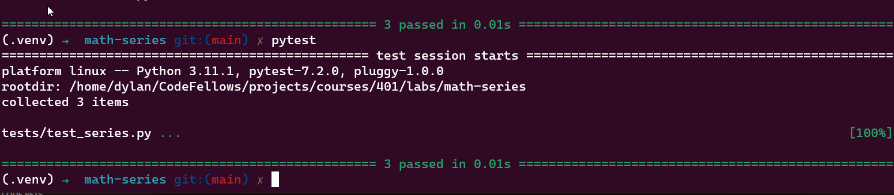

# LAB 
Class 02 Math series

this is a lab exploring finding the nth number in the fibbonacci sequence this is our first step into recursion

# Project: 

Modules and Testing
## Author: 

Dylan Cabral

## Setup
How to initialize/run your application (where applicable)

1. clone repoitory
2. create venv
3. activate venv
4. pip install pytest
```
python math_series.py

```



## Tests
[Tests](tests/test_series.py)

## How do you run tests?

```
# In math_series directory
# with venv activated

pytest
```
